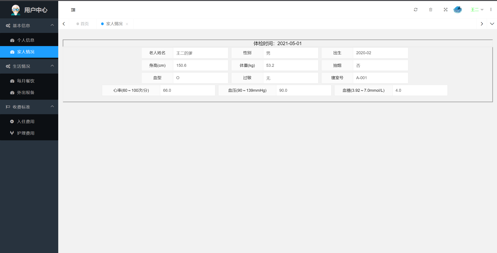
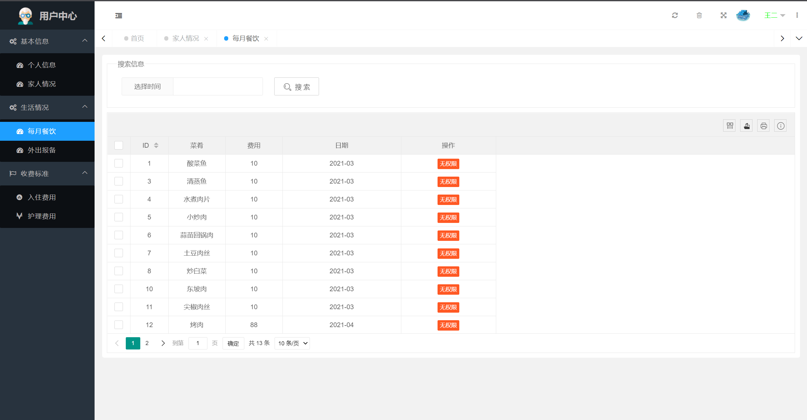
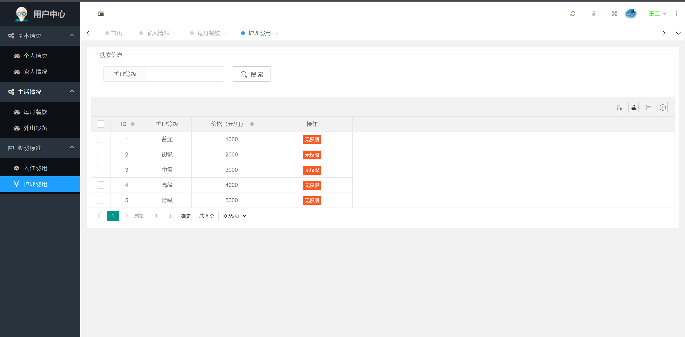
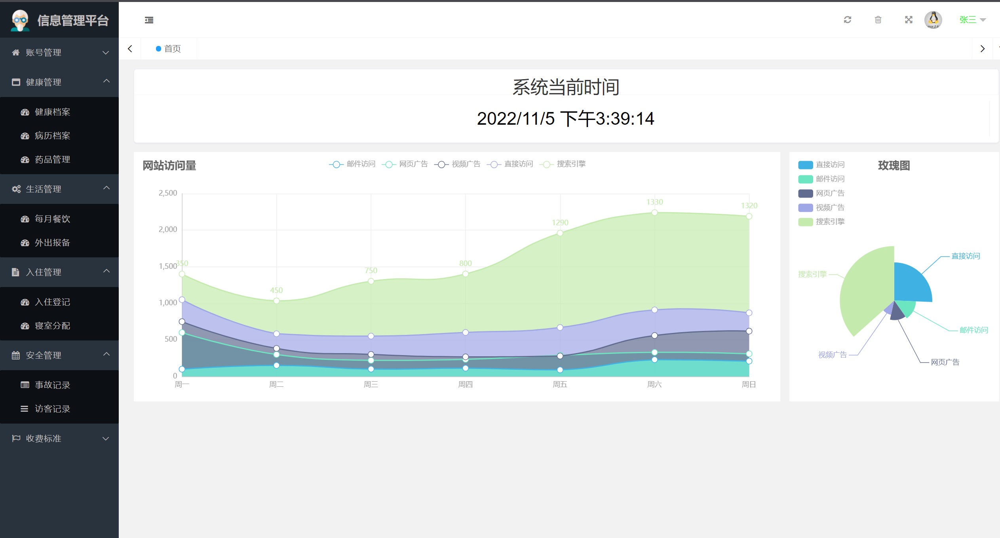
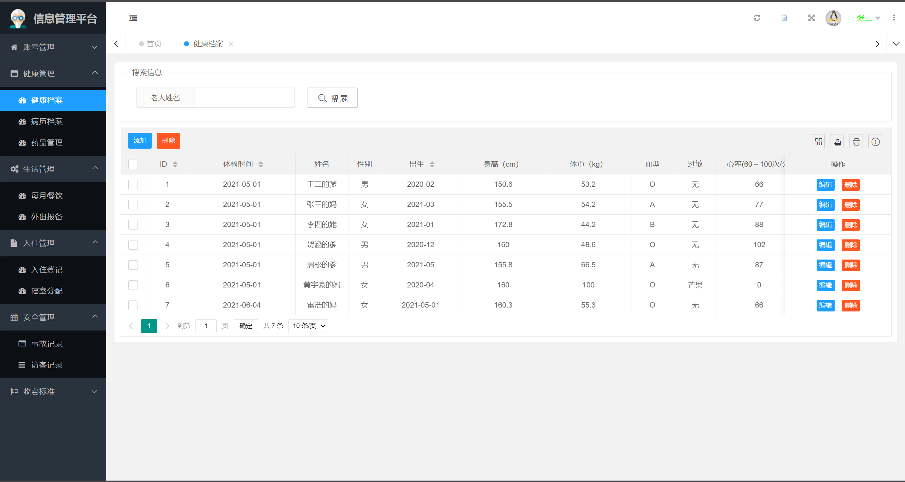
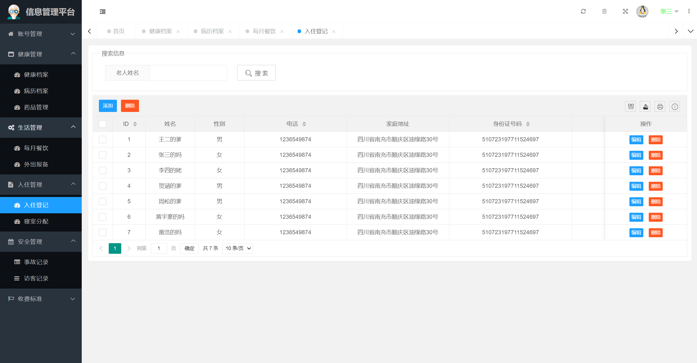
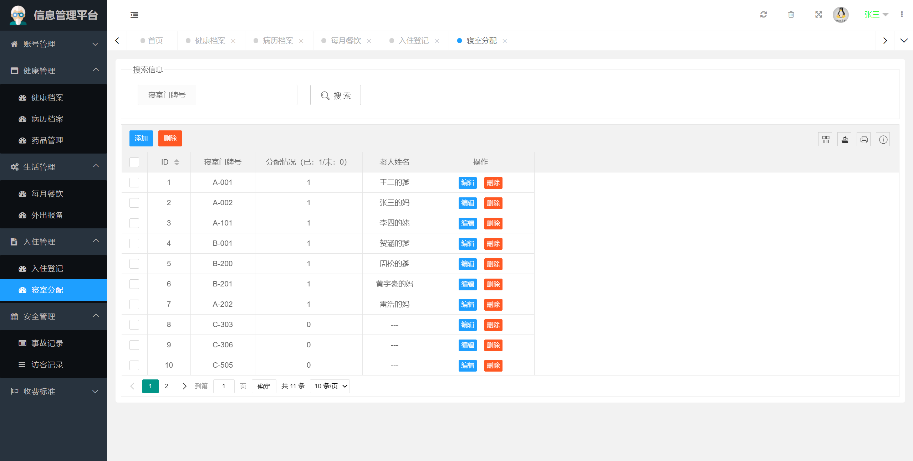

## 基于SpringBoot的养老院信息管理系统

###  获取sql数据库文件: 从戎源码网 (https://armycodes.com/) QQ: 386869957 QQ群: 377586148
###  所有系统地址: (https://github.com/YuLin-Coder/AllProjectCatalog) 
###  所有项目以及源代码本人均调试运行无问题 可支持远程安装部署调试、定制修改、代码讲解

## 项目介绍
基于SpringBoot的养老院信息管理系统，有用户、管理员、超级管理员3个角色，主要功能如下

### 【管理员】:
账号管理：管理员账号、用户账号
健康管理：健康档案、病例档案、药品管理
生活管理：每月餐饮、外出报备
入住管理：入驻登记、寝室分配
安全管理：事故记录、访客记录
收费标准：入住费用、护理费用

### 【用户】:
基本信息：个人信息、家庭情况
生活情况：每月餐饮、外出报备
收费标准：入住费用、护理费用

## 项目技术
- 编程语言：Java
- 数据库：MySQL
- 项目管理工具：Maven
- 前端技术：HTML、CSS、JavaScript、Bootstrap
- 后端技术：Spring、SpringMVC、MyBatis

## 运行环境
- JDK版本：JDK1.8及以上
- 开发工具：IDEA、Ecplise、Myecplise都可以
- 数据库: MySQL5.7及以上
- Maven：maven3.0及以上

## 运行截图

